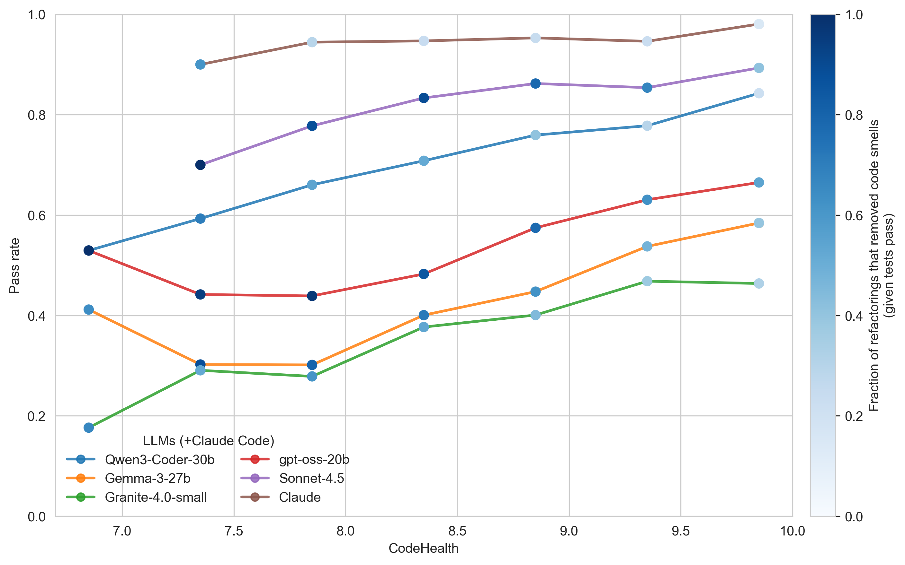
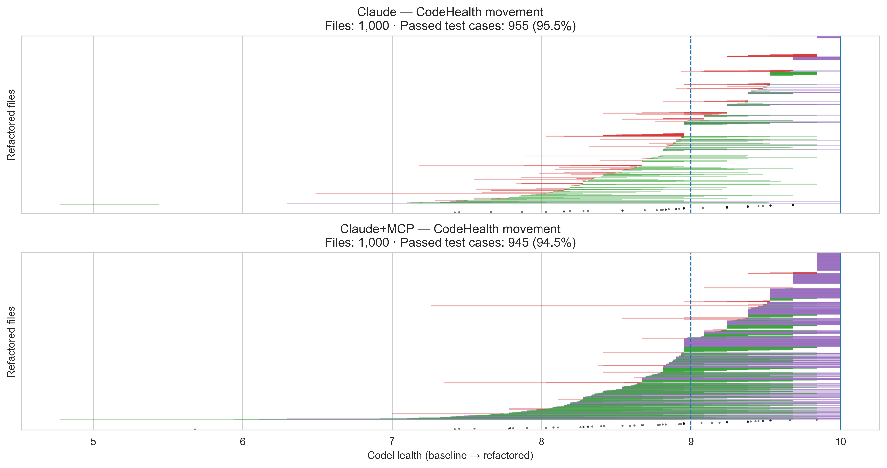

# CodeHealth as a Prerequisite and Compass for Coding Agents

<a href="https://codescene.com/">CodeScene</a> research direction maintained by <a href="https://mrksbrg.com/">Dr. Markus Borg</a>

**Thesis:** High-quality code has never been more important than in the AI era.

1. **Healthy code is more AI-friendly**: it is easier for coding agents to analyze, modify, and extend without introducing unintended side effects.

2. **Human readability remains vital** as the volume of AI-generated code grows. The future will be *hybrid*, and humans will continue to read, review, and reason about code when it matters most.

  <strong><a href="#codehealth">CodeHealth</a> acts as a compass for both humans and coding agents, guiding code toward sustained maintainability over time.</strong>

---

## Code quality is a prerequisite for successful agent deployment

We studied refactoring success as a proxy for how effectively AI systems can work with code of varying quality [[2]](#ref-forge26). Our experiments use the public training set of competitive programming solutions released with [DeepMind's AlphaCode](https://www.science.org/doi/10.1126/science.abq1158). Across these experiments, LLMs consistently perform better when operating on healthier code.

Figure 1 below shows test pass rates as a function of CodeHealth when LLMs are prompted to *improve maintainability in Python files*. For reference, Claude Code pinned to Sonnet 4.5 is shown alongside other models (brown curve). The color of each data point indicates the fraction of refactorings that removed at least one code smell, conditional on passing tests.

<figure id="fig-llm-codehealth">
  
  <figcaption style="font-size: 0.9em; opacity: 0.75; text-align: center;">
    <strong>Figure 1.</strong>
    Test pass rates after refactoring as a function of CodeHealth.
  </figcaption>
</figure>

### Takeaways

- **Higher CodeHealth decreases refactoring risk** across all evaluated models.
- **The trend is consistent across model classes**, from medium-sized open models to state-of-the-art Sonnet 4.5.
- **As CodeHealth increases, LLMs identify fewer code smells to remove**, reflecting a shift toward more cosmetic changes.
- **Claude exhibits the most conservative behavior**: the lighter blue markers reveal that many test-passing refactorings involve limited structural change (reported in related work [[4]](#ref-msr26))

  <strong>A healthy codebase substantially increases the likelihood of successful coding agent deployment.</strong>

---

## Coding agents need CodeHealth guidance
We studied the effect of giving Claude Code access to CodeHealth through our MCP server. As shown in Figure 2, explicit CodeHealth guidance fundamentally changes how capable the agent becomes.

The upper plot shows file-level results for Claude corresponding to the brown curve in Figure 1. The lower plot shows the same setup *with* CodeHealth provided as an explicit compass for the agent.

Each horizontal line represents the **CodeHealth journey of a single file**:
- **Green** lines indicate files whose CodeHealth improved; line length reflects the magnitude of improvement.
- **Purple** lines indicate files that reached a perfect CodeHealth score of 10.
- **Red** lines indicate files whose CodeHealth decreased.
- **White gaps** correspond to files whose CodeHealth remained unchanged.
- **Black points** mark refactorings that did not pass the test suite.

<figure id="fig-claude-mcp">
  
  <figcaption style="font-size: 0.9em; opacity: 0.75; text-align: center;">
    <strong>Figure 2.</strong>
    Effect of providing Claude Code with CodeHealth guidance via MCP.
  </figcaption>
</figure>

### Takeaways

- **CodeHealth provides a clear optimization target** for iterative agentic refactoring.
- **Claude maintains a high test pass rate** (≈95%) even while making structural improvements.
- **In every second file (52%), all code smells are removed**, compared to only 5.7% without CodeHealth guidance.
- **Most files improve substantially**: more than 90% reach a human- and AI-friendly state, compared to 24.1% without CodeHealth guidance.

  <strong>Providing coding agents with <a href="#codehealth">CodeHealth</a> via an MCP server gives them a clear quality-oriented direction.</strong>

  The value of using CodeHealth as a compass also **generalizes to C++ and Java**, supported by large-scale experiments with a self-hosted coding agent and medium-sized LLMs.
  <a href="/compass/multilang.html">Learn more.</a>

---

## What is CodeHealth™?

CodeHealth is a code quality metric that aligns with how engineers perceive maintainability. CodeHealth is a score between 1 and 10 where the top score represents files without code smells. Files with a CodeHealth of 9 or higher are considered healthy. Peer-reviewed research shows that higher CodeHealth is associated with outcomes that matter for software-intensive organizations.
- **Healthy code** is associated with, on average, **15× fewer defects**, **2× faster feature implementation**, and **10× lower uncertainty in task completion** [[5]](#ref-techdebt22)
- **CodeHealth provides a shared language** for discussing the business impact of code quality with executive stakeholders [[3]](#ref-techdebt24)
- **CodeHealth outperforms established alternatives**, performing **6× better than SonarQube’s metric** on a public benchmark and outperforming the traditional **Maintainability Index** [[1]](#ref-icsme24)

## References

  <ol>
    <li id="ref-icsme24">
      Borg, Ezzouhri, and Tornhill.
      <em>Ghost Echoes Revealed: Benchmarking Maintainability Metrics and Machine Learning Predictions Against Human Assessments.</em>
      In Proc. of the 40th Int’l. Conf. on Software Maintenance and Evolution (ICSME), 2024.
      <a href="https://arxiv.org/pdf/2408.10754">arXiv</a>
    </li>

    <li id="ref-forge26">
      Borg, Hagatulah, Tornhill, and Söderberg.
      <em>Code for Machines, Not Just Humans: Quantifying AI-Friendliness with Code Health Metrics.</em>
      In Proc. of the 3rd ACM Int’l. Conf. on AI Foundation Models and Software Engineering (FORGE), 2026.
      <a href="https://arxiv.org/abs/2601.02200">arXiv</a>
    </li>

    <li id="ref-techdebt24">
      Borg, Pruvost, Mones, and Tornhill.
      <em>Increasing, not Diminishing: Investigating the Returns of Highly Maintainable Code.</em>
      In Proc. of the 7th Int’l. Conf. on Technical Debt, pp. 21–30, 2024. 
      <a href="https://arxiv.org/pdf/2401.13407">arXiv</a> 🏆 *Best Paper Award* 
    </li>

    <li id="ref-msr26">
      Ottenhof, Penner, Hindle, and Lutellier.
      <em>How do Agents Refactor: An Empirical Study.</em>
      In Proc. of the 23rd Int’l. Conf. on Mining Software Repositories (MSR), 2026.
      <a href="https://arxiv.org/abs/2601.20160">arXiv</a>
    </li>

    <li id="ref-techdebt22">
      Tornhill and Borg.
      <em>Code Red: The Business Impact of Code Quality – A Quantitative Study of 39 Proprietary Production Codebases.</em>
      In Proc. of the 5th Int’l. Conf. on Technical Debt (TechDebt), pp. 11–20, 2022.
      <a href="https://arxiv.org/pdf/2203.04374">arXiv</a>
    </li>
  </ol>

---

  This research was conducted at CodeScene and Lund University with support from Vinnova, Sweden’s Innovation Agency.
    

  

    

    

    
  

