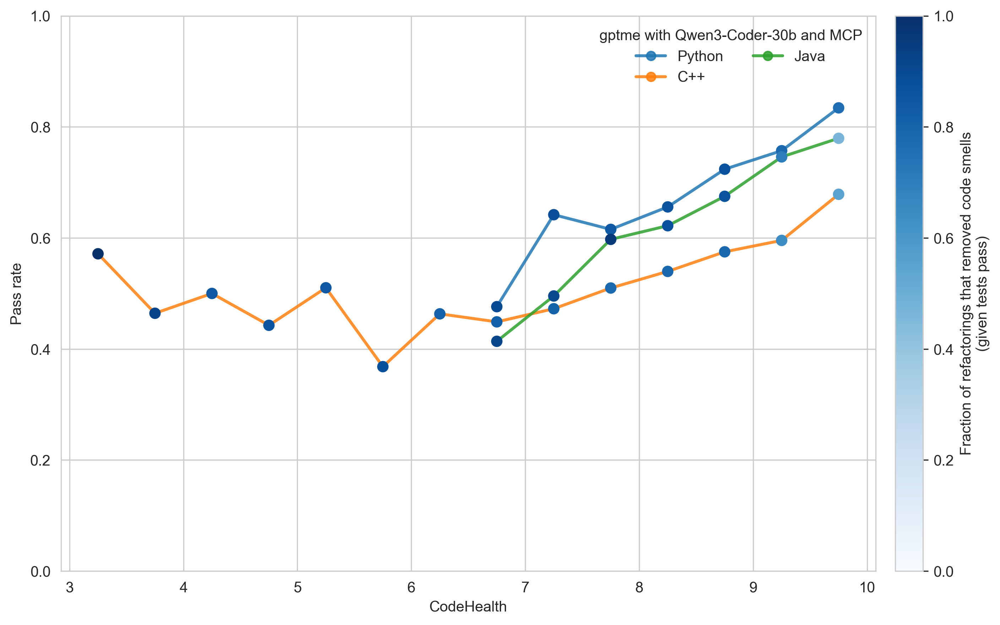
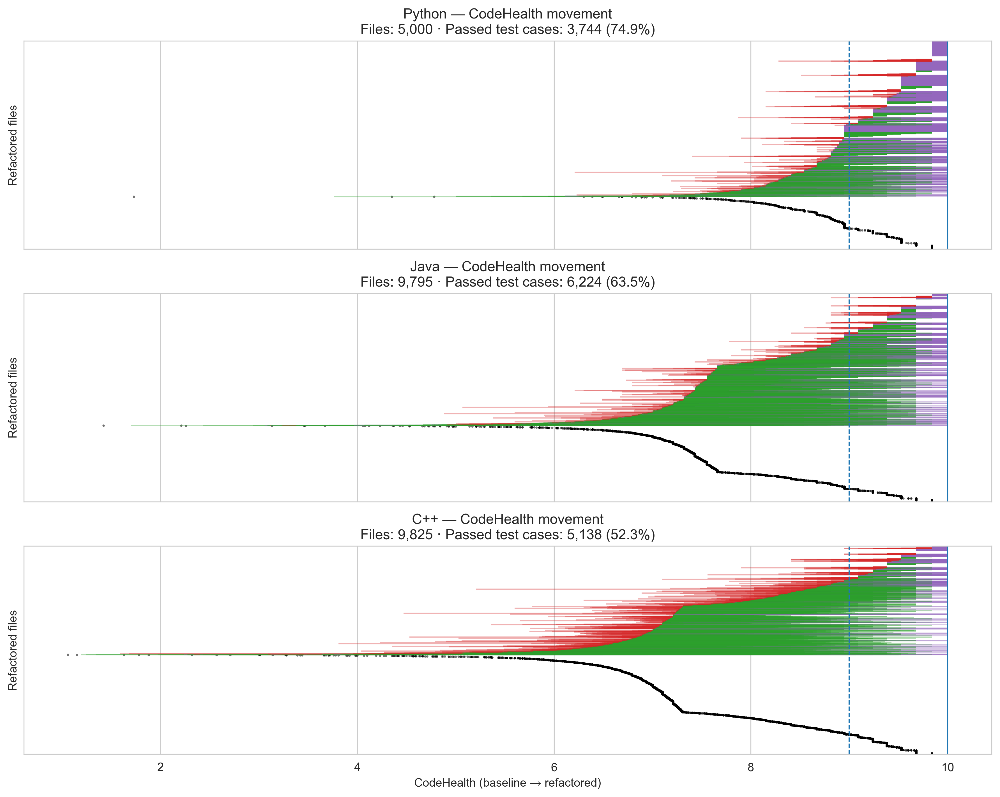

# Multi-language Evidence: Guiding Coding Agents Beyond Python

<a href="/compass/">Back to overall page</a>

This page provides supporting evidence that the value of using <a href="/compass/#codehealth">CodeHealth</a> as a compass for coding agents generalizes beyond Python.

For this series of experiments, we deployed a self-hosted instance of the open-source coding agent [gptme](https://gptme.org/) on infrastructure equipped with NVIDIA A100 GPUs. On the same server, the agent used Qwen3-Coder-30b as the underlying LLM. This is the strongest medium-sized model we have worked with and, critically, it supports *tool calling* and integration with the CodeScene MCP server.

<figure id="fig-gptme-mcp">
  
  <figcaption style="font-size: 0.9em; opacity: 0.75; text-align: center;">
    <strong>Figure 1.</strong>
    gptme with Qwen3 and CodeHealth guidance via MCP.
  </figcaption>
</figure>

### Takeaways

- **The relationship between CodeHealth and refactoring reliability generalizes across languages** once CodeHealth exceeds approximately 7.
- **Agentic refactoring is most effective for Python**, slightly less so for Java, while **C++ is more challenging** for the agent.
- **Explicit CodeHealth guidance helps keep even a less capable agent on track**, as indicated by the predominantly dark-blue markers corresponding to meaningful code smell removal.

<figure id="fig-gptme-mcp">
  
  <figcaption style="font-size: 0.9em; opacity: 0.75; text-align: center;">
    <strong>Figure 2.</strong>
    Detailed results from refactoring with gptme guided by CodeHealth.
  </figcaption>
</figure>

---

  This research was conducted at CodeScene and Lund University with support from Vinnova, Sweden’s Innovation Agency.
    

  

    

    

    
  

